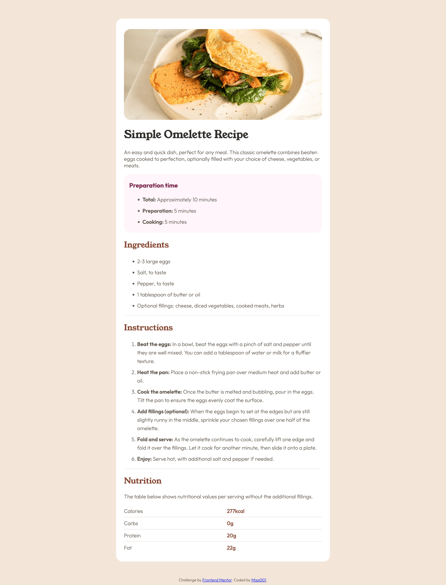

# Frontend Mentor - Recipe page solution

This is a solution to the [Recipe page challenge on Frontend Mentor](https://www.frontendmentor.io/challenges/recipe-page-KiTsR8QQKm). Frontend Mentor challenges help you improve your coding skills by building realistic projects. 

## Table of contents

- [Overview](#overview)
  - [The challenge](#the-challenge)
  - [Screenshot](#screenshot)
  - [Links](#links)
- [My process](#my-process)
  - [Built with](#built-with)
  - [What I learned](#what-i-learned)
  - [Continued development](#continued-development)
  - [Useful resources](#useful-resources)
- [Author](#author)

## Overview

### Screenshot

### Links

- Solution URL: https://github.com/mmisa0009/recipe-page-main.git
- Live Site URL: https://mmisa0009.github.io/recipe-page-main/

## My process

- 1 design with figma to get to know basic deisign elements (looking back, I did not have to do this.)
- 2 build basic html structure
- 3 build css stylesheet
- 4 modify the small parts and check on live

### Built with

- Semantic HTML5 markup
- CSS custom properties (stylesheet: styles.css)
- Flexbox

### What I learned

Used rem and em to make a responsive website (able to extend the screen). Learned basics of the css styling and html. 

### Continued development

More smooth usage of css styling sheet. Would like to learn animation or more responsive website building. 

### Useful resources

- Kevin Powell (https://www.youtube.com/kevinpowell) - This helped learn why certain css coding does not work, and how to fix it. Highly recommend for practical advice.

## Author

- Website - Misa M
- Frontend Mentor - @mmisa0009(https://www.frontendmentor.io/profile/mmisa0009)

